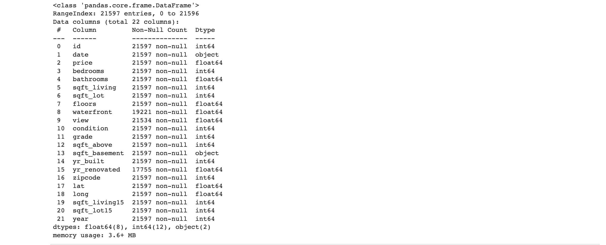
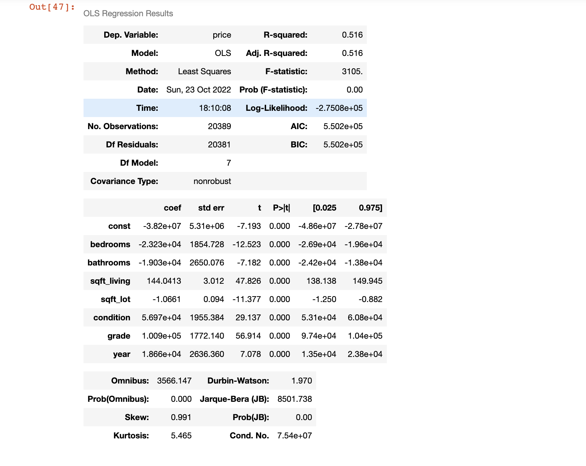

# Phase 2 Project

<h1 align=center>King County Housing Analysis</h1>

**Author: Chris Freyre**

## Project Overview & Business Problem

In this project I will provide information, using regression modeling analysis of house sales data in King County, for Real-State agencies to advise home owners on how performing a renovation might increase price of home sales and if so, what factors are relevant to this renovation.

### Data Understanding

From kc_house_data.csv. the data contains a record of 21597 houses sold in the King County in the period of 2014-2015. We have what it seems 9 categories within the data. First we have id and date which do not appear to be relevant at this stage, next we have price prediction target which will be our dependant variable. Thirdly we have quantity of bedrooms, bathrooms and floors, there is also a scored system for the properties by grade and condition. We also have several dimensions in square foot such as living area, lot area, above and basement, we will investigate in depth for the most relevant. We have location data by zipcode, lat, long and square foot 15 (nearest 15 neighbours). Lastly we have year built, year renovated, views and waterfront.

I investigated unique values in columns:

* Waterfront
* Views
* Grade
* Condition

Inspecting the data types

Through viewing the initial data, I can see the data types we are working with, they are: integers, floats and objects - it is clear that we'll need to investigate and clean the data.

## Data Cleaning

* I started checking for duplicates using the "ID" column, where I proceeded to delete the duplicates. 
* I noticed that in the "Sqft_living" column we had it as an object data type, this lead me to find and replace "?" for "0"
* "Yr_renovated" column was a data type float so I changed it to integer.
* Checking for missing values, they were only located in "waterfront", "view" and "yr_renovated" columns.

After having cleaner data and a much better undestanding of it, I proceeded to drop columns not related to the task. Dropping ID, date, view, sqft_above, sqft_basement, yr_renovated, zipcode, lat, long, sqft_living15 and sqft_lot15. 

I plotted a visualization of correlation using the heat map:

Since we have a dependent variable of price I decided to plot the relationship between price and other columns:

I proceeded to obtain all outliers by using the empirical rule, that 99.7% of the data is within 3 standard deviations of the mean, and clearly we can see a house with 33 bedrooms or a house with 8 bathrooms.

Keeping data within 3 standard deviations of the mean

<h1 align=center>Modelling the data</h1>

# Model 1
After all these processes, the data is ready for a baseline model giving us an R-squared value of 0.516, with a high condition number that indicated multicollinearity or other numerical problem and as we plot we can see that it did not follow a linear regression.

Checking assumption of linear regression

# Model 2
Iterating on the baseline model, I created dummy variables for Grade, Bedrooms and Bathrooms to try to improve the R-squared value. This resulted in an increase of the R-sqaured value to 0.535. However, we can see that the condition number is too high and the assumption of regression is still off. 

While performing a T-Test and cross validation, I found that the results were overfitting quite substantially with a very high MSE.

# Final model

For my final model, I performed a log transformation on Price and Sqft Living, since the data had a left sided skew. I also used the dummy variables in my previous model, plus newly added Condition dummies.

Although the R-squared value went down slightly to 0.526, we can see an improved assumption of linear regression and an improvement of the condition number.

Validating this model using the T-test and cross validation, I found the MSE was a much more acceptable value of 0.10, meaning the model is more accurate.

## Summary

* Model 3 provided the best fit for linear regression with an R- Squared value of 0.526. Meaning that it represents 52.6% of the data.
* Validating it with T-test, provided a Mean Squared Error value: 0.10 (MSE)
* Cross validation resulted in 0.10
* Highest Coeff contributing to a high price by high condition and grade, implying a quality renovation is key to sell at a higher price:  
                 
                 
                 • Grade 11 = 1.2728 Coeff
                 • Condition 5 = 1.5164 Coeff

# Recommendation
I would recommend Real Estate agencies advise their clients that the price of properties tend to increase by square foot living, bedrooms and bathrooms. In relation to renovation, it's best to provide a high condition rate of 5, or at least in a range 2 to 5, and a high grade rate of 11, or at least in a range 5 to 11.

